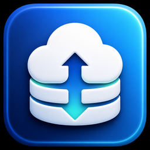

# S3 Browser



**小身材，直连云端。**

一个用 Tauri 2 + Rust 打造的轻量 macOS S3 / 华为云 OBS 客户端。

没有内置浏览器的沉重行李，没有绕一圈的服务端中转，AK/SK 只在你的电脑上干活。

> Electron 下班了。现在轮到 Rust 值夜班。

## 它能干什么

- 连接 AWS S3、华为云 OBS 及其他 S3 兼容存储
- 根据 Endpoint 自动识别 Region，不再单独填写机房
- 支持指定桶登录，受限 AK 没有 `ListBuckets` 权限也能用
- 浏览桶、目录和对象
- 上传、下载、删除文件
- 复制预签名直链和 `curl` 下载命令
- 生成 `obsutil` 文件夹下载命令
- 导入、导出 OBS 配置文件

## 为什么重写

旧版本能用，但 Electron 为一个 S3 客户端带来的体积有点过于豪迈。

现在：

- 前端继续使用 React + Next.js，界面开发不受罪
- 桌面壳换成 Tauri，不再捆绑整套 Chromium
- S3 请求、签名和文件操作交给 Rust
- 发布包从“大块头”变成更像工具该有的尺寸

简单说：该有的都有，不该胖的地方瘦下来了。

## 华为云 OBS

Endpoint 可以直接填写：

```text
obs.cn-east-3.myhuaweicloud.com
```

Region 会自动识别为 `cn-east-3`。

如果账号没有列出全部桶的权限，在登录页填写一个有权访问的桶名称即可。客户端会直接验证该桶，不再拿 `ListBuckets` 撞权限墙。

## 技术栈

| 部分 | 技术 |
| --- | --- |
| 桌面框架 | Tauri 2 |
| 云存储核心 | Rust + AWS SDK for Rust |
| 界面 | Next.js + React |
| 系统能力 | Tauri Dialog / File System Plugins |

所有云存储请求都由 [`src-tauri/`](src-tauri/) 中的 Rust 后端直接完成。

## 开发

需要 Node.js、npm 和 Rust stable：

```bash
npm install
rustup default stable
npm run tauri:dev
```

## 检查

```bash
npm run lint
npm run build
cargo check --manifest-path src-tauri/Cargo.toml
```

## 构建

```bash
npm run tauri:build
```

产物位于：

```text
src-tauri/target/release/bundle/
```

当前 macOS 发布版本面向 Apple Silicon。

## 安全

- 凭据不会上传到中间服务器
- 仓库不包含任何真实 AK/SK
- 构建产物、环境文件和证书默认不会进入 Git

云上的东西很贵，删除按钮也是真的。动手前看清楚对象名。
